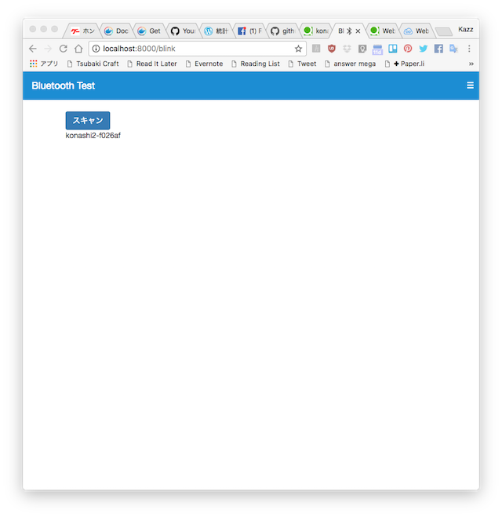

# Web Bluetooth Example

ChromeのWeb Bluetooth機能を使ってBluetooth Low Energyデバイスを操作する簡単なサンプルプログラム。ユカイ工学さんのKonashiを使った例です。

## 実行環境
- Google Chrome バージョン62.0.3202.94

ChromeのExperimental Web Platform featuresを有効にしてください。-> chrome://flags/#enable-experimental-web-platform-features

## 使用ライブラリ
- AngularJS
- Angular Route
- Angular Touch
- Bootstrap
- ngDialog
- jQuery
など

## 説明

Web Bluetooth機能を使用しているのはKonashiBlinkController.jsの中にあります。その中でデバイス検索->デバイスに接続->サービスの取得->キャラクタりスティックの取得->キャラクタりスティックへの出力（LED点滅）を行なっています。

簡単なプログラムなのに多くのJavaScriptライブラリやソースファイルがあるのは、普段使っているWebアプリケーションのテンプレートを使用しているためですので、Web Bluetoothの機能だけに関心がある場合はKonashiBlinkController.jsのblink.htmlだけ見れば良いと思います。

Angular Routeを使っているので何らかのHTTPサーバーにデプロイしないと正常に動作しません。一番簡単な方法はPythonのHTTPサーバーを使うことです。プロジェクトのディレクトに移動して以下のコマンドを実行すればPythonのHTTPサーバーを使ってこのアプリケーションを動かせます。

    $ cd プロジェクトディレクトリ
    $ python3 -m http.server

## 参考情報

- [Web Bluetooth API](https://webbluetoothcg.github.io/web-bluetooth/)
- [Konashi](http://konashi.ux-xu.com/documents/)
